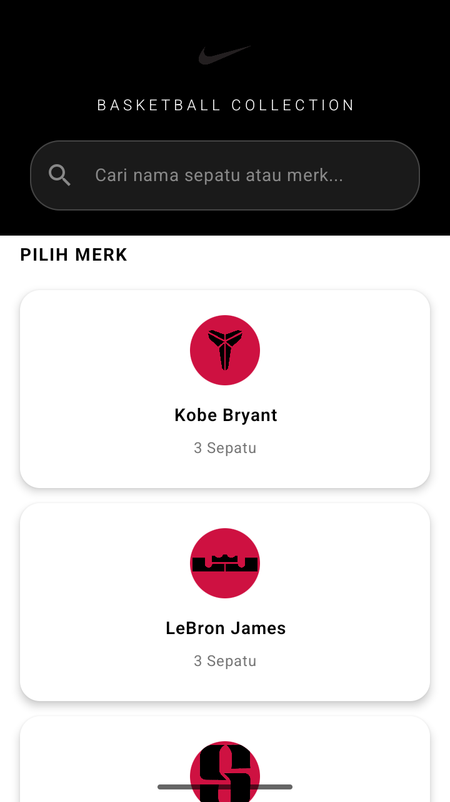
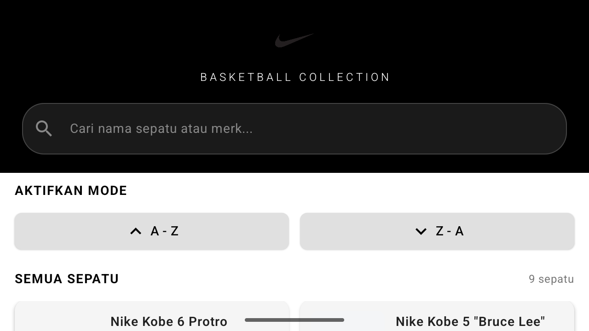
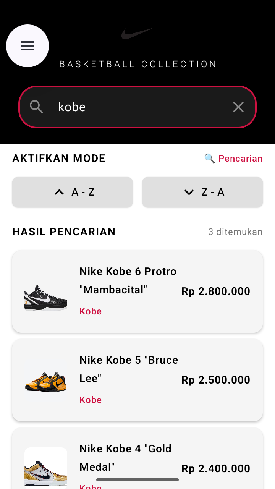
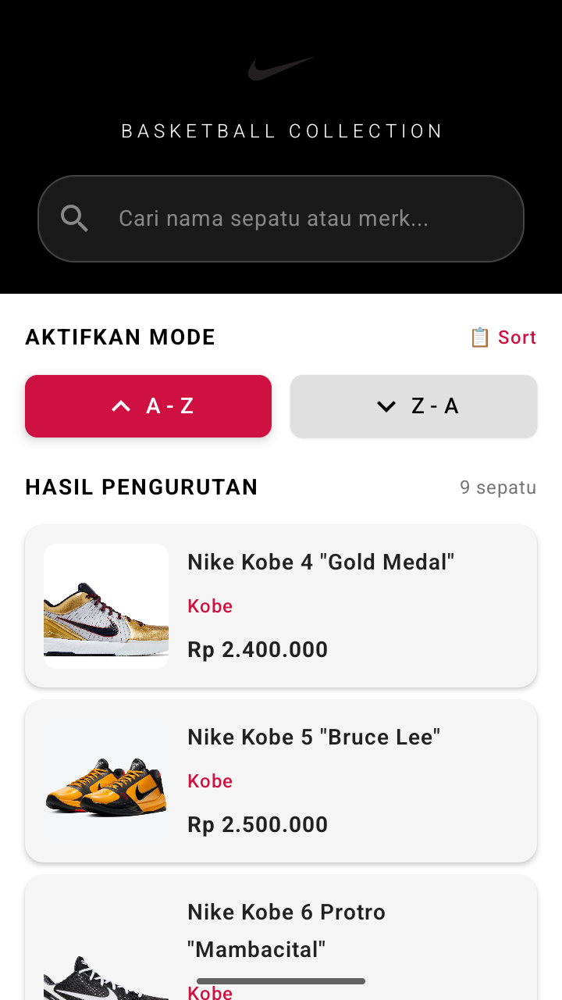
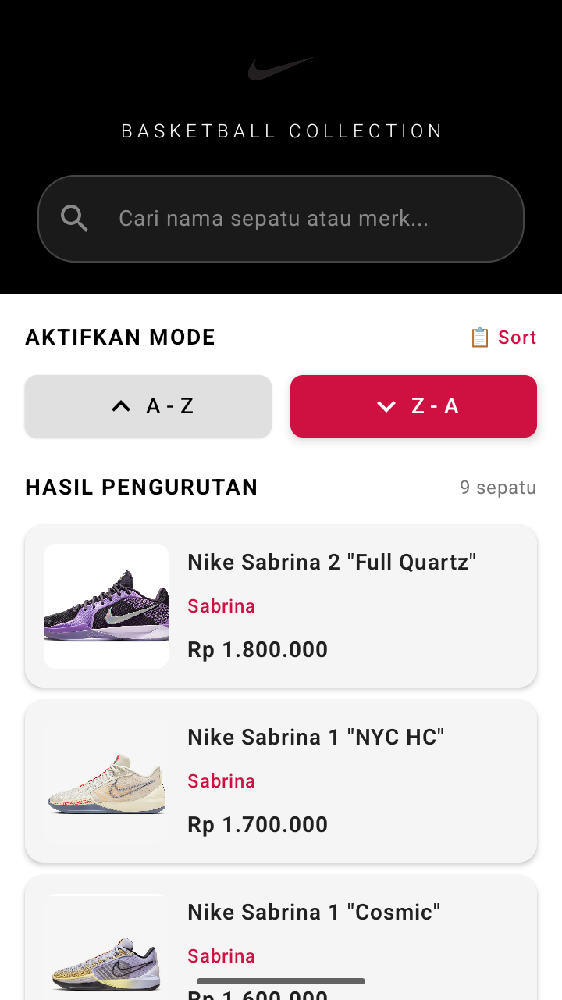

# Katalog Sepatu Basket Nike

Aplikasi katalog sepatu basket Nike untuk memenuhi tugas akademik — berisi koleksi sepatu dari 3 atlet NBA: Kobe Bryant, LeBron James, dan Sabrina Ionescu.

---

## Credits

- **Nama:** Gede Troy Wiswama Bhareswara
- **NIM:** 42430052
- **Mata Kuliah:** Pemrograman Seluler

---

## Screenshots

### 🏠 Portrait Mode
Halaman utama dengan tampilan 3 kartu atlet NBA — Kobe Bryant, LeBron James, dan Sabrina Ionescu.



### 🏞️ Landscape Mode
Daftar koleksi sepatu Kobe Bryant dengan harga dalam Rupiah.



### 🔎 Fitur Pencarian (Linear Search)
Pencarian case-insensitive berdasarkan nama atau merk menggunakan algoritma Linear Search.



### ↕️ Fitur Pengurutan (Bubble Sort)
Pengurutan data sepatu secara A-Z dan Z-A menggunakan algoritma Bubble Sort.





---

## Deskripsi

Aplikasi Android ini menampilkan katalog sepatu basket Nike dengan fitur:
- **Navigasi antar halaman** untuk memilih merk dan melihat detail sepatu
- **Pencarian** dengan Linear Search (cari berdasarkan nama/merk)
- **Pengurutan** dengan Bubble Sort (A-Z dan Z-A)
- **Responsif** — tampilan menyesuaikan saat layar di-rotate
- **Error Handling** dengan Try-Catch
- **Logging** aktivitas aplikasi menggunakan Logcat

---

## Fitur Utama

| Fitur | Modul | Keterangan |
|-------|-------|------------|
| UI Responsif | Modul 2-3 | Tampilan Portrait & Landscape |
| Navigasi | Modul 4-5 | Perpindahan halaman antar screen |
| Validasi Input | Modul 4-5 | If-Else untuk validasi form |
| Array Data | Modul 6 | Data sepatu dalam Array |
| Linear Search | Modul 6 | Pencarian data case-insensitive |
| Bubble Sort | Modul 7 | Pengurutan A-Z dan Z-A |
| Try-Catch | Modul 9 | Penanganan error |
| Logcat | Modul 9 | Perekaman aktivitas aplikasi |

---

## Struktur Data

### 3 Merk × 3 Sepatu = 9 Total

**Kobe Bryant:**
1. Nike Kobe 6 Protro "Mambacital" — Rp 2.800.000
2. Nike Kobe 5 "Bruce Lee" — Rp 2.500.000
3. Nike Kobe 4 "Gold Medal" — Rp 2.400.000

**LeBron James:**
1. Nike LeBron 21 — Rp 3.200.000
2. Nike LeBron 20 "Cortez" — Rp 2.800.000
3. Nike LeBron NXXT "Dominate" — Rp 2.600.000

**Sabrina Ionescu:**
1. Nike Sabrina 2 "Full Quartz" — Rp 1.800.000
2. Nike Sabrina 1 "Cosmic" — Rp 1.600.000
3. Nike Sabrina 1 "NYC HC" — Rp 1.700.000

---

## Struktur Project

```
katalogsepatu/
├── app/src/main/java/com/troy/katalog_sepatu/
│   ├── MainActivity.kt           # Entry point + Navigation
│   ├── data/
│   │   └── ShoeData.kt          # Array data 9 sepatu
│   ├── model/
│   │   └── Shoe.kt              # Data class Shoe
│   ├── screens/
│   │   ├── HomeScreen.kt        # Landing page
│   │   ├── BrandListScreen.kt   # Daftar sepatu/merk
│   │   ├── DetailScreen.kt      # Detail sepatu
│   │   ├── SearchScreen.kt      # Pencarian
│   │   └── SortScreen.kt        # Pengurutan
│   ├── components/
│   │   └── ShoeCard.kt          # Reusable card composable
│   ├── viewmodel/
│   │   └── ShoeViewModel.kt     # Logic Search & Sort
│   └── ui/theme/
│       └── Color.kt             # Tema warna
└── res/
    ├── drawable/
    │   └── ic_nike_logo.png    # Logo Nike
    └── ...
```

---

## Cara Install & Run

### Prerequisites
- Android Studio Hedgehog atau lebih baru
- Android SDK API 24+
- Kotlin 2.0.21

### Langkah

1. **Clone/Download** project ini
2. **Buka** di Android Studio
3. **Sync** Gradle (`File > Sync Project with Gradle Files`)
4. **Run** (`Shift + F10`) atau klik tombol Run ▶

### Build APK

```bash
cd katalogsepatu
./gradlew assembleDebug
```

APK akan tersedia di:
```
app/build/outputs/apk/debug/app-debug.apk
```

---

## Tech Stack

| Teknologi | Versi |
|-----------|-------|
| Kotlin | 2.0.21 |
| Jetpack Compose | BOM 2024.09.00 |
| Material 3 | Latest |
| Android Gradle Plugin | 9.0.1 |
| minSdk | 24 |
| targetSdk | 36 |

---

## Logcat

Tag Log: `42430052`

```bash
adb logcat -s 42430052
```

Contoh output:
```
D/42430052: Activity started
D/42430052: Navigating to brand: Kobe
D/42430052: Shoe clicked: Nike Kobe 6 Protro "Mambacital"
D/42430052: Searching: kobe
D/42430052: Sorting A-Z berhasil
```

---

## Lisensi

Project ini dibuat untuk keperluan akademik - Tugas UAS Pemrograman Seluler.

